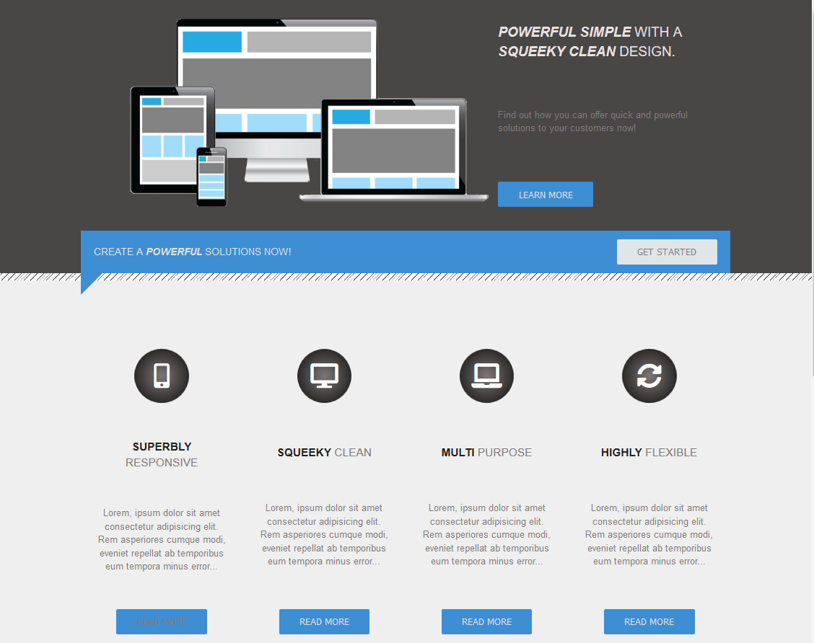

# Cloning a responsive website using HTML and CSS only.

This project is developed as part of my 6 months coding bootcamp at Integrify Helsinki . We are supposed to clone a reference website and make it responsive using only HTML and CSS. Happy Coding 😀.

## Demo

You can see the live demo of the website here:

[(https://sulaymon333.github.io/cloning-a-responsive-website-HTML-CSS/)](https://sulaymon333.github.io/cloning-a-responsive-website-HTML-CSS/)

# 

## Authors

- [Sulaymon Tajudeen](https://sulaymontajudeen.com/)

## Technologies

-   HTML
-   CSS

## License

This project is licensed under the MIT License - see the [LICENSE.md](./LICENSE.md) file for details.